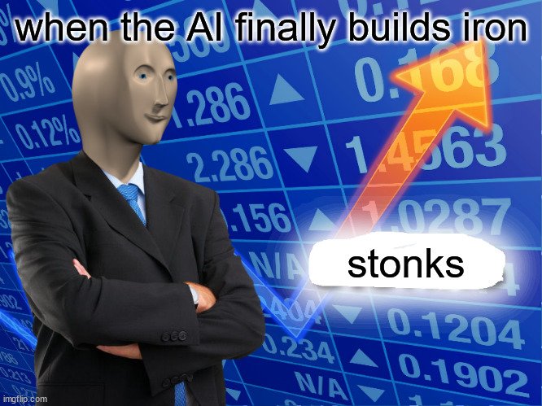

# Economy Jumpstarter

**Tested With V3 Version: 1.8.6**

Places a building producing 10 iron, sulfur, lead, and coal in each capital. This results in the AI building more mines, resulting in more construction using Iron-Frame Buildings, resulting in the AI having a more competitive economy and better GDP growth.

Essentially, it's a hack to make the AI less stupid.
